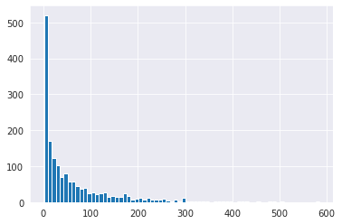
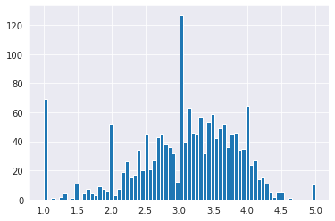
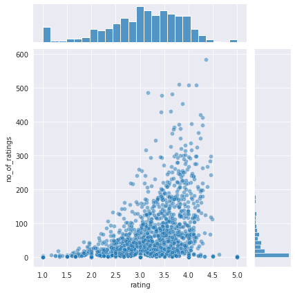

# Recommender Systems
A recommender system is a system typically used in music or video streaming services like Netflix or Spotify, in order to provide a recommendation of content based on the content the user has interacted with or enjoyed. In this project we will use a simple recommendation system which uses the pandas module to correlate the user ratings of movies with other movies, and recommend the most similar movies. In this project we are using a popular movie database.

## Imports


```python
import pandas as pd
import numpy as np
```


```python
columns_names = ['user_id','item_id','rating','timestamp']
```


```python
df = pd.read_csv('u.data',sep='\t',names=columns_names)
```


```python
df.head()
```


<div>
<style scoped>
    .dataframe tbody tr th:only-of-type {
        vertical-align: middle;
    }

    .dataframe tbody tr th {
        vertical-align: top;
    }

    .dataframe thead th {
        text-align: right;
    }
</style>
<table border="1" class="dataframe">
  <thead>
    <tr style="text-align: right;">
      <th></th>
      <th>user_id</th>
      <th>item_id</th>
      <th>rating</th>
      <th>timestamp</th>
    </tr>
  </thead>
  <tbody>
    <tr>
      <th>0</th>
      <td>0</td>
      <td>50</td>
      <td>5</td>
      <td>881250949</td>
    </tr>
    <tr>
      <th>1</th>
      <td>0</td>
      <td>172</td>
      <td>5</td>
      <td>881250949</td>
    </tr>
    <tr>
      <th>2</th>
      <td>0</td>
      <td>133</td>
      <td>1</td>
      <td>881250949</td>
    </tr>
    <tr>
      <th>3</th>
      <td>196</td>
      <td>242</td>
      <td>3</td>
      <td>881250949</td>
    </tr>
    <tr>
      <th>4</th>
      <td>186</td>
      <td>302</td>
      <td>3</td>
      <td>891717742</td>
    </tr>
  </tbody>
</table>
</div>


```python
movie_titles = pd.read_csv('Movie_Id_Titles')
```


```python
movie_titles.head()
```


<div>
<style scoped>
    .dataframe tbody tr th:only-of-type {
        vertical-align: middle;
    }

    .dataframe tbody tr th {
        vertical-align: top;
    }

    .dataframe thead th {
        text-align: right;
    }
</style>
<table border="1" class="dataframe">
  <thead>
    <tr style="text-align: right;">
      <th></th>
      <th>item_id</th>
      <th>title</th>
    </tr>
  </thead>
  <tbody>
    <tr>
      <th>0</th>
      <td>1</td>
      <td>Toy Story (1995)</td>
    </tr>
    <tr>
      <th>1</th>
      <td>2</td>
      <td>GoldenEye (1995)</td>
    </tr>
    <tr>
      <th>2</th>
      <td>3</td>
      <td>Four Rooms (1995)</td>
    </tr>
    <tr>
      <th>3</th>
      <td>4</td>
      <td>Get Shorty (1995)</td>
    </tr>
    <tr>
      <th>4</th>
      <td>5</td>
      <td>Copycat (1995)</td>
    </tr>
  </tbody>
</table>
</div>


```python
df = pd.merge(df,movie_titles,on='item_id')
```


```python
df.head()
```


<div>
<style scoped>
    .dataframe tbody tr th:only-of-type {
        vertical-align: middle;
    }

    .dataframe tbody tr th {
        vertical-align: top;
    }

    .dataframe thead th {
        text-align: right;
    }
</style>
<table border="1" class="dataframe">
  <thead>
    <tr style="text-align: right;">
      <th></th>
      <th>user_id</th>
      <th>item_id</th>
      <th>rating</th>
      <th>timestamp</th>
      <th>title</th>
    </tr>
  </thead>
  <tbody>
    <tr>
      <th>0</th>
      <td>0</td>
      <td>50</td>
      <td>5</td>
      <td>881250949</td>
      <td>Star Wars (1977)</td>
    </tr>
    <tr>
      <th>1</th>
      <td>290</td>
      <td>50</td>
      <td>5</td>
      <td>880473582</td>
      <td>Star Wars (1977)</td>
    </tr>
    <tr>
      <th>2</th>
      <td>79</td>
      <td>50</td>
      <td>4</td>
      <td>891271545</td>
      <td>Star Wars (1977)</td>
    </tr>
    <tr>
      <th>3</th>
      <td>2</td>
      <td>50</td>
      <td>5</td>
      <td>888552084</td>
      <td>Star Wars (1977)</td>
    </tr>
    <tr>
      <th>4</th>
      <td>8</td>
      <td>50</td>
      <td>5</td>
      <td>879362124</td>
      <td>Star Wars (1977)</td>
    </tr>
  </tbody>
</table>
</div>


```python
import matplotlib.pyplot as plt
import seaborn as sns
sns.set_style('white')
%matplotlib inline
```


```python
df.groupby('title')['rating'].mean().sort_values(ascending=False)
```


    title
    They Made Me a Criminal (1939)                  5.0
    Marlene Dietrich: Shadow and Light (1996)       5.0
    Saint of Fort Washington, The (1993)            5.0
    Someone Else's America (1995)                   5.0
    Star Kid (1997)                                 5.0
                                                   ... 
    Eye of Vichy, The (Oeil de Vichy, L') (1993)    1.0
    King of New York (1990)                         1.0
    Touki Bouki (Journey of the Hyena) (1973)       1.0
    Bloody Child, The (1996)                        1.0
    Crude Oasis, The (1995)                         1.0
    Name: rating, Length: 1664, dtype: float64


```python
df.groupby('title')['rating'].count().sort_values(ascending=False)
```


    title
    Star Wars (1977)                      584
    Contact (1997)                        509
    Fargo (1996)                          508
    Return of the Jedi (1983)             507
    Liar Liar (1997)                      485
                                         ... 
    Great Day in Harlem, A (1994)           1
    Other Voices, Other Rooms (1997)        1
    Good Morning (1971)                     1
    Girls Town (1996)                       1
    Á köldum klaka (Cold Fever) (1994)      1
    Name: rating, Length: 1664, dtype: int64


## Data Visualisation


```python
ratings = pd.DataFrame(df.groupby('title')['rating'].mean())
```


```python
ratings.head()
```


<div>
<style scoped>
    .dataframe tbody tr th:only-of-type {
        vertical-align: middle;
    }

    .dataframe tbody tr th {
        vertical-align: top;
    }

    .dataframe thead th {
        text-align: right;
    }
</style>
<table border="1" class="dataframe">
  <thead>
    <tr style="text-align: right;">
      <th></th>
      <th>rating</th>
    </tr>
    <tr>
      <th>title</th>
      <th></th>
    </tr>
  </thead>
  <tbody>
    <tr>
      <th>'Til There Was You (1997)</th>
      <td>2.333333</td>
    </tr>
    <tr>
      <th>1-900 (1994)</th>
      <td>2.600000</td>
    </tr>
    <tr>
      <th>101 Dalmatians (1996)</th>
      <td>2.908257</td>
    </tr>
    <tr>
      <th>12 Angry Men (1957)</th>
      <td>4.344000</td>
    </tr>
    <tr>
      <th>187 (1997)</th>
      <td>3.024390</td>
    </tr>
  </tbody>
</table>
</div>


```python
ratings['no_of_ratings'] = df.groupby('title')['rating'].count()
```


```python
ratings.head()
```


<div>
<style scoped>
    .dataframe tbody tr th:only-of-type {
        vertical-align: middle;
    }

    .dataframe tbody tr th {
        vertical-align: top;
    }

    .dataframe thead th {
        text-align: right;
    }
</style>
<table border="1" class="dataframe">
  <thead>
    <tr style="text-align: right;">
      <th></th>
      <th>rating</th>
      <th>no_of_ratings</th>
    </tr>
    <tr>
      <th>title</th>
      <th></th>
      <th></th>
    </tr>
  </thead>
  <tbody>
    <tr>
      <th>'Til There Was You (1997)</th>
      <td>2.333333</td>
      <td>9</td>
    </tr>
    <tr>
      <th>1-900 (1994)</th>
      <td>2.600000</td>
      <td>5</td>
    </tr>
    <tr>
      <th>101 Dalmatians (1996)</th>
      <td>2.908257</td>
      <td>109</td>
    </tr>
    <tr>
      <th>12 Angry Men (1957)</th>
      <td>4.344000</td>
      <td>125</td>
    </tr>
    <tr>
      <th>187 (1997)</th>
      <td>3.024390</td>
      <td>41</td>
    </tr>
  </tbody>
</table>
</div>


```python
sns.set_style('darkgrid')
ratings['no_of_ratings'].hist(bins=70)
```


    <AxesSubplot:>


    

    


```python
ratings['rating'].hist(bins=70)
```


    <AxesSubplot:>


    

    


```python
sns.jointplot(x='rating',y='no_of_ratings',data=ratings,alpha=0.5)
```


    <seaborn.axisgrid.JointGrid at 0x7fccdbd9de50>


    

    


```python
moviemat = df.pivot_table(index='user_id', columns='title',values='rating')
```


```python
moviemat
```


<div>
<style scoped>
    .dataframe tbody tr th:only-of-type {
        vertical-align: middle;
    }

    .dataframe tbody tr th {
        vertical-align: top;
    }

    .dataframe thead th {
        text-align: right;
    }
</style>
<table border="1" class="dataframe">
  <thead>
    <tr style="text-align: right;">
      <th>title</th>
      <th>'Til There Was You (1997)</th>
      <th>1-900 (1994)</th>
      <th>101 Dalmatians (1996)</th>
      <th>12 Angry Men (1957)</th>
      <th>187 (1997)</th>
      <th>2 Days in the Valley (1996)</th>
      <th>20,000 Leagues Under the Sea (1954)</th>
      <th>2001: A Space Odyssey (1968)</th>
      <th>3 Ninjas: High Noon At Mega Mountain (1998)</th>
      <th>39 Steps, The (1935)</th>
      <th>...</th>
      <th>Yankee Zulu (1994)</th>
      <th>Year of the Horse (1997)</th>
      <th>You So Crazy (1994)</th>
      <th>Young Frankenstein (1974)</th>
      <th>Young Guns (1988)</th>
      <th>Young Guns II (1990)</th>
      <th>Young Poisoner's Handbook, The (1995)</th>
      <th>Zeus and Roxanne (1997)</th>
      <th>unknown</th>
      <th>Á köldum klaka (Cold Fever) (1994)</th>
    </tr>
    <tr>
      <th>user_id</th>
      <th></th>
      <th></th>
      <th></th>
      <th></th>
      <th></th>
      <th></th>
      <th></th>
      <th></th>
      <th></th>
      <th></th>
      <th></th>
      <th></th>
      <th></th>
      <th></th>
      <th></th>
      <th></th>
      <th></th>
      <th></th>
      <th></th>
      <th></th>
      <th></th>
    </tr>
  </thead>
  <tbody>
    <tr>
      <th>0</th>
      <td>NaN</td>
      <td>NaN</td>
      <td>NaN</td>
      <td>NaN</td>
      <td>NaN</td>
      <td>NaN</td>
      <td>NaN</td>
      <td>NaN</td>
      <td>NaN</td>
      <td>NaN</td>
      <td>...</td>
      <td>NaN</td>
      <td>NaN</td>
      <td>NaN</td>
      <td>NaN</td>
      <td>NaN</td>
      <td>NaN</td>
      <td>NaN</td>
      <td>NaN</td>
      <td>NaN</td>
      <td>NaN</td>
    </tr>
    <tr>
      <th>1</th>
      <td>NaN</td>
      <td>NaN</td>
      <td>2.0</td>
      <td>5.0</td>
      <td>NaN</td>
      <td>NaN</td>
      <td>3.0</td>
      <td>4.0</td>
      <td>NaN</td>
      <td>NaN</td>
      <td>...</td>
      <td>NaN</td>
      <td>NaN</td>
      <td>NaN</td>
      <td>5.0</td>
      <td>3.0</td>
      <td>NaN</td>
      <td>NaN</td>
      <td>NaN</td>
      <td>4.0</td>
      <td>NaN</td>
    </tr>
    <tr>
      <th>2</th>
      <td>NaN</td>
      <td>NaN</td>
      <td>NaN</td>
      <td>NaN</td>
      <td>NaN</td>
      <td>NaN</td>
      <td>NaN</td>
      <td>NaN</td>
      <td>1.0</td>
      <td>NaN</td>
      <td>...</td>
      <td>NaN</td>
      <td>NaN</td>
      <td>NaN</td>
      <td>NaN</td>
      <td>NaN</td>
      <td>NaN</td>
      <td>NaN</td>
      <td>NaN</td>
      <td>NaN</td>
      <td>NaN</td>
    </tr>
    <tr>
      <th>3</th>
      <td>NaN</td>
      <td>NaN</td>
      <td>NaN</td>
      <td>NaN</td>
      <td>2.0</td>
      <td>NaN</td>
      <td>NaN</td>
      <td>NaN</td>
      <td>NaN</td>
      <td>NaN</td>
      <td>...</td>
      <td>NaN</td>
      <td>NaN</td>
      <td>NaN</td>
      <td>NaN</td>
      <td>NaN</td>
      <td>NaN</td>
      <td>NaN</td>
      <td>NaN</td>
      <td>NaN</td>
      <td>NaN</td>
    </tr>
    <tr>
      <th>4</th>
      <td>NaN</td>
      <td>NaN</td>
      <td>NaN</td>
      <td>NaN</td>
      <td>NaN</td>
      <td>NaN</td>
      <td>NaN</td>
      <td>NaN</td>
      <td>NaN</td>
      <td>NaN</td>
      <td>...</td>
      <td>NaN</td>
      <td>NaN</td>
      <td>NaN</td>
      <td>NaN</td>
      <td>NaN</td>
      <td>NaN</td>
      <td>NaN</td>
      <td>NaN</td>
      <td>NaN</td>
      <td>NaN</td>
    </tr>
    <tr>
      <th>...</th>
      <td>...</td>
      <td>...</td>
      <td>...</td>
      <td>...</td>
      <td>...</td>
      <td>...</td>
      <td>...</td>
      <td>...</td>
      <td>...</td>
      <td>...</td>
      <td>...</td>
      <td>...</td>
      <td>...</td>
      <td>...</td>
      <td>...</td>
      <td>...</td>
      <td>...</td>
      <td>...</td>
      <td>...</td>
      <td>...</td>
      <td>...</td>
    </tr>
    <tr>
      <th>939</th>
      <td>NaN</td>
      <td>NaN</td>
      <td>NaN</td>
      <td>NaN</td>
      <td>NaN</td>
      <td>NaN</td>
      <td>NaN</td>
      <td>NaN</td>
      <td>NaN</td>
      <td>NaN</td>
      <td>...</td>
      <td>NaN</td>
      <td>NaN</td>
      <td>NaN</td>
      <td>NaN</td>
      <td>NaN</td>
      <td>NaN</td>
      <td>NaN</td>
      <td>NaN</td>
      <td>NaN</td>
      <td>NaN</td>
    </tr>
    <tr>
      <th>940</th>
      <td>NaN</td>
      <td>NaN</td>
      <td>NaN</td>
      <td>NaN</td>
      <td>NaN</td>
      <td>NaN</td>
      <td>NaN</td>
      <td>NaN</td>
      <td>NaN</td>
      <td>NaN</td>
      <td>...</td>
      <td>NaN</td>
      <td>NaN</td>
      <td>NaN</td>
      <td>NaN</td>
      <td>NaN</td>
      <td>NaN</td>
      <td>NaN</td>
      <td>NaN</td>
      <td>NaN</td>
      <td>NaN</td>
    </tr>
    <tr>
      <th>941</th>
      <td>NaN</td>
      <td>NaN</td>
      <td>NaN</td>
      <td>NaN</td>
      <td>NaN</td>
      <td>NaN</td>
      <td>NaN</td>
      <td>NaN</td>
      <td>NaN</td>
      <td>NaN</td>
      <td>...</td>
      <td>NaN</td>
      <td>NaN</td>
      <td>NaN</td>
      <td>NaN</td>
      <td>NaN</td>
      <td>NaN</td>
      <td>NaN</td>
      <td>NaN</td>
      <td>NaN</td>
      <td>NaN</td>
    </tr>
    <tr>
      <th>942</th>
      <td>NaN</td>
      <td>NaN</td>
      <td>NaN</td>
      <td>NaN</td>
      <td>NaN</td>
      <td>NaN</td>
      <td>NaN</td>
      <td>3.0</td>
      <td>NaN</td>
      <td>3.0</td>
      <td>...</td>
      <td>NaN</td>
      <td>NaN</td>
      <td>NaN</td>
      <td>NaN</td>
      <td>NaN</td>
      <td>NaN</td>
      <td>NaN</td>
      <td>NaN</td>
      <td>NaN</td>
      <td>NaN</td>
    </tr>
    <tr>
      <th>943</th>
      <td>NaN</td>
      <td>NaN</td>
      <td>NaN</td>
      <td>NaN</td>
      <td>NaN</td>
      <td>2.0</td>
      <td>NaN</td>
      <td>NaN</td>
      <td>NaN</td>
      <td>NaN</td>
      <td>...</td>
      <td>NaN</td>
      <td>NaN</td>
      <td>NaN</td>
      <td>NaN</td>
      <td>4.0</td>
      <td>3.0</td>
      <td>NaN</td>
      <td>NaN</td>
      <td>NaN</td>
      <td>NaN</td>
    </tr>
  </tbody>
</table>
<p>944 rows × 1664 columns</p>
</div>


```python
ratings.sort_values('no_of_ratings',ascending=False).head(10)
```


<div>
<style scoped>
    .dataframe tbody tr th:only-of-type {
        vertical-align: middle;
    }

    .dataframe tbody tr th {
        vertical-align: top;
    }

    .dataframe thead th {
        text-align: right;
    }
</style>
<table border="1" class="dataframe">
  <thead>
    <tr style="text-align: right;">
      <th></th>
      <th>rating</th>
      <th>no_of_ratings</th>
    </tr>
    <tr>
      <th>title</th>
      <th></th>
      <th></th>
    </tr>
  </thead>
  <tbody>
    <tr>
      <th>Star Wars (1977)</th>
      <td>4.359589</td>
      <td>584</td>
    </tr>
    <tr>
      <th>Contact (1997)</th>
      <td>3.803536</td>
      <td>509</td>
    </tr>
    <tr>
      <th>Fargo (1996)</th>
      <td>4.155512</td>
      <td>508</td>
    </tr>
    <tr>
      <th>Return of the Jedi (1983)</th>
      <td>4.007890</td>
      <td>507</td>
    </tr>
    <tr>
      <th>Liar Liar (1997)</th>
      <td>3.156701</td>
      <td>485</td>
    </tr>
    <tr>
      <th>English Patient, The (1996)</th>
      <td>3.656965</td>
      <td>481</td>
    </tr>
    <tr>
      <th>Scream (1996)</th>
      <td>3.441423</td>
      <td>478</td>
    </tr>
    <tr>
      <th>Toy Story (1995)</th>
      <td>3.878319</td>
      <td>452</td>
    </tr>
    <tr>
      <th>Air Force One (1997)</th>
      <td>3.631090</td>
      <td>431</td>
    </tr>
    <tr>
      <th>Independence Day (ID4) (1996)</th>
      <td>3.438228</td>
      <td>429</td>
    </tr>
  </tbody>
</table>
</div>


## Recommendation System : For Star Wars and Liar Liar

Now we will use the corrwith() function in pandas to find out which movies are most similar to 2 selected movies Star Wars(1977) and Liar Liar(1997). corrwith() is used to correlate the rating of each user with the ratings of other movies row by row so if several people who rated Star Wars high rated The Empire Strikes Back (1980) high then it returns a higher value and so on.


```python
starwars_user_ratings = moviemat['Star Wars (1977)']
```


```python
liarliar_user_ratings = moviemat['Liar Liar (1997)']
```


```python
starwars_user_ratings.head()
```


    user_id
    0    5.0
    1    5.0
    2    5.0
    3    NaN
    4    5.0
    Name: Star Wars (1977), dtype: float64


```python
similar_to_starwars = moviemat.corrwith(starwars_user_ratings)

```

    /home/bogeymantan/anaconda3/lib/python3.9/site-packages/numpy/lib/function_base.py:2683: RuntimeWarning: Degrees of freedom <= 0 for slice
      c = cov(x, y, rowvar, dtype=dtype)
    /home/bogeymantan/anaconda3/lib/python3.9/site-packages/numpy/lib/function_base.py:2542: RuntimeWarning: divide by zero encountered in true_divide
      c *= np.true_divide(1, fact)


```python
similar_to_starwars.sort_values(ascending=False)
```


    title
    Commandments (1997)                        1.0
    Cosi (1996)                                1.0
    No Escape (1994)                           1.0
    Stripes (1981)                             1.0
    Man of the Year (1995)                     1.0
                                              ... 
    Wonderland (1997)                          NaN
    Wooden Man's Bride, The (Wu Kui) (1994)    NaN
    Yankee Zulu (1994)                         NaN
    You So Crazy (1994)                        NaN
    Á köldum klaka (Cold Fever) (1994)         NaN
    Length: 1664, dtype: float64


```python
similar_to_liarliar = moviemat.corrwith(liarliar_user_ratings)
```

    /home/bogeymantan/anaconda3/lib/python3.9/site-packages/numpy/lib/function_base.py:2683: RuntimeWarning: Degrees of freedom <= 0 for slice
      c = cov(x, y, rowvar, dtype=dtype)
    /home/bogeymantan/anaconda3/lib/python3.9/site-packages/numpy/lib/function_base.py:2542: RuntimeWarning: divide by zero encountered in true_divide
      c *= np.true_divide(1, fact)


```python
similar_to_liarliar.sort_values(ascending=False)
```


    title
    Bonheur, Le (1965)                                          1.0
    For Ever Mozart (1996)                                      1.0
    Crossfire (1947)                                            1.0
    Johnny 100 Pesos (1993)                                     1.0
    Moonlight and Valentino (1995)                              1.0
                                                               ... 
    Wonderful, Horrible Life of Leni Riefenstahl, The (1993)    NaN
    World of Apu, The (Apur Sansar) (1959)                      NaN
    Yankee Zulu (1994)                                          NaN
    You So Crazy (1994)                                         NaN
    Á köldum klaka (Cold Fever) (1994)                          NaN
    Length: 1664, dtype: float64


```python
corr_star_wars = pd.DataFrame(similar_to_starwars,columns=['Correlation'])
corr_star_wars.dropna(inplace=True)
corr_liar_liar = pd.DataFrame(similar_to_liarliar,columns=['Correlation'])
corr_liar_liar.dropna(inplace=True)
```


```python
corr_star_wars.sort_values('Correlation',ascending=False)
```


<div>
<style scoped>
    .dataframe tbody tr th:only-of-type {
        vertical-align: middle;
    }

    .dataframe tbody tr th {
        vertical-align: top;
    }

    .dataframe thead th {
        text-align: right;
    }
</style>
<table border="1" class="dataframe">
  <thead>
    <tr style="text-align: right;">
      <th></th>
      <th>Correlation</th>
    </tr>
    <tr>
      <th>title</th>
      <th></th>
    </tr>
  </thead>
  <tbody>
    <tr>
      <th>Commandments (1997)</th>
      <td>1.0</td>
    </tr>
    <tr>
      <th>Cosi (1996)</th>
      <td>1.0</td>
    </tr>
    <tr>
      <th>No Escape (1994)</th>
      <td>1.0</td>
    </tr>
    <tr>
      <th>Stripes (1981)</th>
      <td>1.0</td>
    </tr>
    <tr>
      <th>Man of the Year (1995)</th>
      <td>1.0</td>
    </tr>
    <tr>
      <th>...</th>
      <td>...</td>
    </tr>
    <tr>
      <th>For Ever Mozart (1996)</th>
      <td>-1.0</td>
    </tr>
    <tr>
      <th>Frankie Starlight (1995)</th>
      <td>-1.0</td>
    </tr>
    <tr>
      <th>I Like It Like That (1994)</th>
      <td>-1.0</td>
    </tr>
    <tr>
      <th>American Dream (1990)</th>
      <td>-1.0</td>
    </tr>
    <tr>
      <th>Theodore Rex (1995)</th>
      <td>-1.0</td>
    </tr>
  </tbody>
</table>
<p>1410 rows × 1 columns</p>
</div>


```python
corr_star_wars = corr_star_wars.join(ratings["no_of_ratings"])
```


```python
corr_star_wars.head()
```


<div>
<style scoped>
    .dataframe tbody tr th:only-of-type {
        vertical-align: middle;
    }

    .dataframe tbody tr th {
        vertical-align: top;
    }

    .dataframe thead th {
        text-align: right;
    }
</style>
<table border="1" class="dataframe">
  <thead>
    <tr style="text-align: right;">
      <th></th>
      <th>Correlation</th>
      <th>no_of_ratings</th>
    </tr>
    <tr>
      <th>title</th>
      <th></th>
      <th></th>
    </tr>
  </thead>
  <tbody>
    <tr>
      <th>'Til There Was You (1997)</th>
      <td>0.872872</td>
      <td>9</td>
    </tr>
    <tr>
      <th>1-900 (1994)</th>
      <td>-0.645497</td>
      <td>5</td>
    </tr>
    <tr>
      <th>101 Dalmatians (1996)</th>
      <td>0.211132</td>
      <td>109</td>
    </tr>
    <tr>
      <th>12 Angry Men (1957)</th>
      <td>0.184289</td>
      <td>125</td>
    </tr>
    <tr>
      <th>187 (1997)</th>
      <td>0.027398</td>
      <td>41</td>
    </tr>
  </tbody>
</table>
</div>


```python
corr_star_wars[corr_star_wars['no_of_ratings']>=100].sort_values('Correlation',ascending=False)
```


<div>
<style scoped>
    .dataframe tbody tr th:only-of-type {
        vertical-align: middle;
    }

    .dataframe tbody tr th {
        vertical-align: top;
    }

    .dataframe thead th {
        text-align: right;
    }
</style>
<table border="1" class="dataframe">
  <thead>
    <tr style="text-align: right;">
      <th></th>
      <th>Correlation</th>
      <th>no_of_ratings</th>
    </tr>
    <tr>
      <th>title</th>
      <th></th>
      <th></th>
    </tr>
  </thead>
  <tbody>
    <tr>
      <th>Star Wars (1977)</th>
      <td>1.000000</td>
      <td>584</td>
    </tr>
    <tr>
      <th>Empire Strikes Back, The (1980)</th>
      <td>0.748353</td>
      <td>368</td>
    </tr>
    <tr>
      <th>Return of the Jedi (1983)</th>
      <td>0.672556</td>
      <td>507</td>
    </tr>
    <tr>
      <th>Raiders of the Lost Ark (1981)</th>
      <td>0.536117</td>
      <td>420</td>
    </tr>
    <tr>
      <th>Austin Powers: International Man of Mystery (1997)</th>
      <td>0.377433</td>
      <td>130</td>
    </tr>
    <tr>
      <th>...</th>
      <td>...</td>
      <td>...</td>
    </tr>
    <tr>
      <th>Edge, The (1997)</th>
      <td>-0.127167</td>
      <td>113</td>
    </tr>
    <tr>
      <th>As Good As It Gets (1997)</th>
      <td>-0.130466</td>
      <td>112</td>
    </tr>
    <tr>
      <th>Crash (1996)</th>
      <td>-0.148507</td>
      <td>128</td>
    </tr>
    <tr>
      <th>G.I. Jane (1997)</th>
      <td>-0.176734</td>
      <td>175</td>
    </tr>
    <tr>
      <th>First Wives Club, The (1996)</th>
      <td>-0.194496</td>
      <td>160</td>
    </tr>
  </tbody>
</table>
<p>338 rows × 2 columns</p>
</div>


```python
corr_liar_liar.head()
```


<div>
<style scoped>
    .dataframe tbody tr th:only-of-type {
        vertical-align: middle;
    }

    .dataframe tbody tr th {
        vertical-align: top;
    }

    .dataframe thead th {
        text-align: right;
    }
</style>
<table border="1" class="dataframe">
  <thead>
    <tr style="text-align: right;">
      <th></th>
      <th>Correlation</th>
    </tr>
    <tr>
      <th>title</th>
      <th></th>
    </tr>
  </thead>
  <tbody>
    <tr>
      <th>'Til There Was You (1997)</th>
      <td>0.118913</td>
    </tr>
    <tr>
      <th>101 Dalmatians (1996)</th>
      <td>0.469765</td>
    </tr>
    <tr>
      <th>12 Angry Men (1957)</th>
      <td>0.066272</td>
    </tr>
    <tr>
      <th>187 (1997)</th>
      <td>0.175145</td>
    </tr>
    <tr>
      <th>2 Days in the Valley (1996)</th>
      <td>0.040739</td>
    </tr>
  </tbody>
</table>
</div>


```python
corr_liar_liar = corr_liar_liar.join(ratings["no_of_ratings"])
```


```python
corr_liar_liar[corr_liar_liar["no_of_ratings"]>=100].sort_values('Correlation',ascending=False)
```


<div>
<style scoped>
    .dataframe tbody tr th:only-of-type {
        vertical-align: middle;
    }

    .dataframe tbody tr th {
        vertical-align: top;
    }

    .dataframe thead th {
        text-align: right;
    }
</style>
<table border="1" class="dataframe">
  <thead>
    <tr style="text-align: right;">
      <th></th>
      <th>Correlation</th>
      <th>no_of_ratings</th>
    </tr>
    <tr>
      <th>title</th>
      <th></th>
      <th></th>
    </tr>
  </thead>
  <tbody>
    <tr>
      <th>Liar Liar (1997)</th>
      <td>1.000000</td>
      <td>485</td>
    </tr>
    <tr>
      <th>Batman Forever (1995)</th>
      <td>0.516968</td>
      <td>114</td>
    </tr>
    <tr>
      <th>Mask, The (1994)</th>
      <td>0.484650</td>
      <td>129</td>
    </tr>
    <tr>
      <th>Down Periscope (1996)</th>
      <td>0.472681</td>
      <td>101</td>
    </tr>
    <tr>
      <th>Con Air (1997)</th>
      <td>0.469828</td>
      <td>137</td>
    </tr>
    <tr>
      <th>...</th>
      <td>...</td>
      <td>...</td>
    </tr>
    <tr>
      <th>Hoop Dreams (1994)</th>
      <td>-0.184503</td>
      <td>117</td>
    </tr>
    <tr>
      <th>Ed Wood (1994)</th>
      <td>-0.199481</td>
      <td>133</td>
    </tr>
    <tr>
      <th>Dr. Strangelove or: How I Learned to Stop Worrying and Love the Bomb (1963)</th>
      <td>-0.238092</td>
      <td>194</td>
    </tr>
    <tr>
      <th>Welcome to the Dollhouse (1995)</th>
      <td>-0.254231</td>
      <td>112</td>
    </tr>
    <tr>
      <th>Raging Bull (1980)</th>
      <td>-0.308129</td>
      <td>116</td>
    </tr>
  </tbody>
</table>
<p>338 rows × 2 columns</p>
</div>


Our recommender system did a good job of selecting similar movies! For Star Wars it aptly selected its sequels (The Empire Strikes Back and Return of the Jedi) along with Raiders of the Lost Ark, whose lead actor plays Han Solo in Star Wars. Similarly it suggested Batman Forever and The Mask, all movies with Jim Carrey just like Liar Liar.
